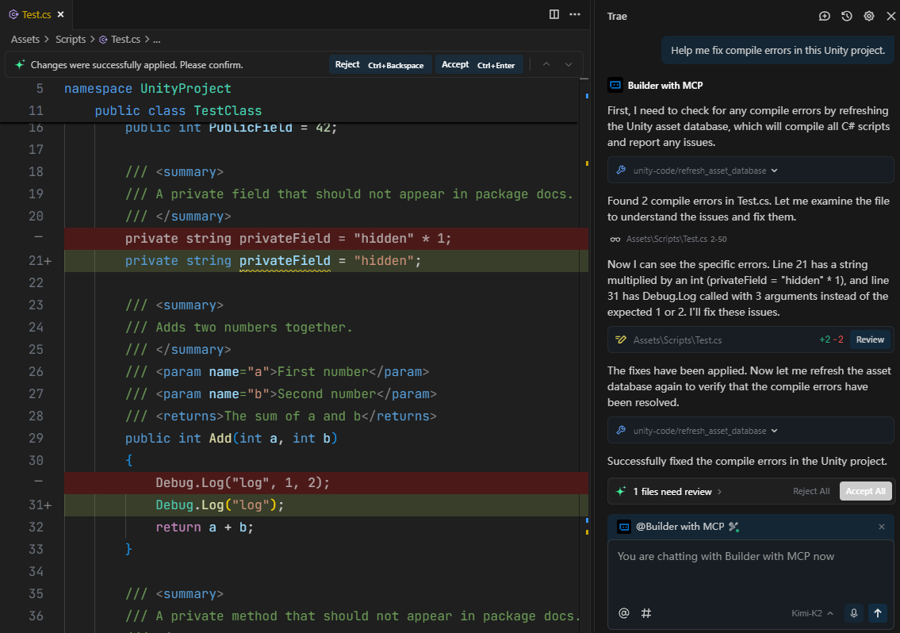

## Description
This package is called Visual Studio Code Editor. It is designed to work with my [Unity Code Pro extension for VS Code](https://github.com/hackerzhuli/unity-code). Making the development experience for Unity games in Cursor, Windsurf and Trae much better.

It also works with my [Unity Code MCP](https://github.com/hackerzhuli/unity_code_mcp), which is an MCP server that allows AI agents (in VS Code, Claude Code, etc.) to compile code and run tests in Unity Editor.

This package is designed for general purpose communication with Unity Editor, focusing on coding workflows, you can use it to power your own coding focused VS Code extensions or MCP servers.

## Features

### Supported VS Code Forks
- Visual Studio Code
- Cursor
- Windsurf
- Trae

About the forks:
All forks are treated as if they are Visual Studio Code, but with different executable name, extension path(where their extensions are installed) and a few other minor differences.

Notes:
- If you use other forks, you need to add their support yourself, it's very easy, look at the file `CodeFork.cs` and add data for your forks to the array `Forks`. If you would like, you can create a pull request to share your changes.

### VS Code Extensions
This package is designed to work with Unity Code Pro and Dot Rush extension for VS Code. But you can still use it with C# Dev Kit and Unity extension, it can work(but the Unity extension will not be able to talk to this package through the networking protocol, you may want to install the official Visual Studio Editor package along with this package if communication between Unity Editor and Unity extension is needed), but I don't officially support it.

#### Dot Rush
[Dot Rush](https://github.com/JaneySprings/DotRush) is a VS Code extension that supports C# IntelliSense, Test Explorer(not including Unity), Debugging(including with debugging Unity) and other features. Think of it as a alternative of the C# extension and C# Dev Kit extension.

#### Unity Code Pro
[Unity Code Pro](https://github.com/hackerzhuli/unity-code) is a VS Code extension that supports Unity Tests, debugging with Unity Editor, a Unity Console to see Unity's logs, and other useful things for Unity projects. Think of it as a alternative to the Unity extension. It is Windows only, but you can build from source for other platforms.

### Unity Code MCP
[Unity Code MCP](https://github.com/hackerzhuli/unity_code_mcp) is a MCP server that enables AI agents to work on Unity project autonomously, by providing tools to compile code and run tests in Unity Editor.

## Unity Version
This package requires Unity 6.0 or higher.

## Platform Support
- I only test on Windows, if you have issues on other platforms, you have to fix it yourself. If you would like, you can create a pull request to share your changes.

## Code Guidelines
- Try to keep code simple and well documented.

For pull requests:
- Try to keep the code changes minimal.
- Please make sure you test the changes before you submit (only on the platform for which you have changed the code)

## Installation
This package can be installed alongside the official Visual Studio Editor package without conflicts. Simply install this package through the Package Manager by git url or through open upm.

## Screenshots
VS Code and its popular forks detected by Unity Editor:

Testing with Unity Code Pro in Trae:

Debugging with Unity Code Pro in Trae:

Tell Kimi K2 to fix compile errors with Unity Code MCP server in Trae(this is only a test, in a real project, AI agents should compile code and fix compile errors after they finished editing scripts without user prompting):

